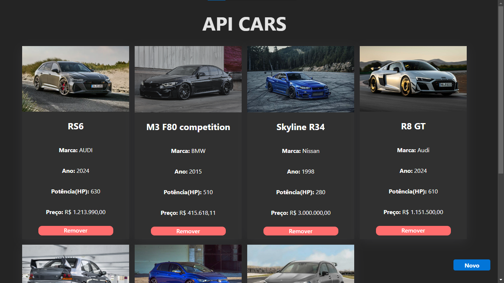
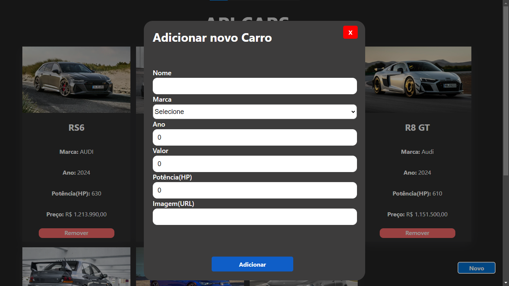

# API CAR FULL STACK
### 🚘  Vehicle control
### 🕹️ Functions
- 1 - Add Car 
- 2 - Remove Car
- 3 - List all Cars

### 🖥️ Technologies:
##### Backend: [Java] & [Spring Boot]
##### Frontend: [React] & [Vite]
##### Database: [PostgreSQL]

### 🔨 Tools:
##### IDEA 1: [IntelliJ IDEA]
##### IDEA 2: [VS Code]
##### Database control: [PgAdmin 4]

### 📷 Project images

 
 

[IntelliJ IDEA]: <https://www.jetbrains.com/idea/>
[VS Code]: <https://code.visualstudio.com/>
[Java]: <https://www.oracle.com/br/java/technologies/downloads/>
[React]: <https://react.dev/>
[Vite]: <https://vitejs.dev/>
[PgAdmin 4]: <https://www.pgadmin.org/download/>
[PostgreSQL]: <https://www.pgadmin.org/download/>
[Spring Boot]: <https://spring.io/projects/spring-boot>